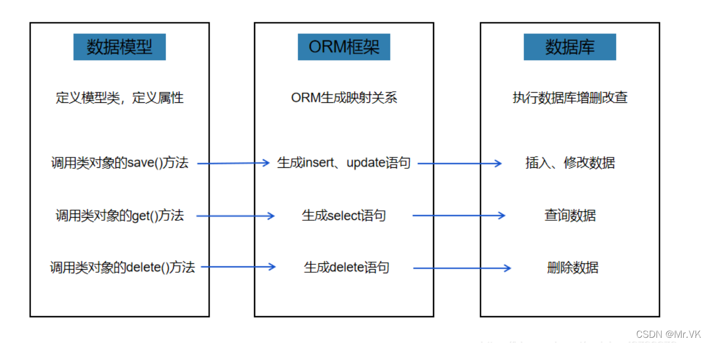

# ORM

## 基本介绍

对象关系映射（Object Relational Mapping，简称ORM）模式是一种为了解决面向对象与关系数据库存在的互不匹配的现象的技术。

是连接数据库的桥梁，只要提供了持久化类与表的映射关系，ORM框架在运行时就能参照映射文件的信息，把对象持久化到数据库中。

## 解释

ORM以最基本的形式建模数据。比如ORM会将MySQL的一张表映射成一个类（模型），表的字段就是这个类的成员变量



## 如何选择

对于我们而言选择ORM框架的目的其实都是为了让我们的程序更好的操作数据库，提高开发编程效率和程序的维护拓展性。因此我们在为自己负责的项目选择合适的ORM框架的时候需要从项目的业务场景出发，选择最适合自己团队的ORM框架

## 举例

1. EF

   Entity Framework (EF) Core 是轻量化、可扩展、开源和跨平台版的常用 Entity Framework 数据访问技术，EF Core 是适用于 .NET 的现代对象数据库映射器。它支持 LINQ 查询、更改跟踪、更新和架构迁移。EF Core 通过提供程序插件 API 与 SQL Server、Azure SQL 数据库、SQLite、Azure Cosmos DB、MySQL、PostgreSQL 和其他数据库一起使用。

2. Dapper

   Dapper是一个简单的.NET对象映射器，在速度方面具有"King of Micro ORM"的头衔，几乎与使用原始的ADO.NET数据读取器一样快。ORM是一个对象关系映射器，它负责数据库和编程语言之间的映射。Dapper通过扩展IDbConnection提供一些有用的扩展方法去查询您的数据库

3. nhibernate

4. Insight.Database

   Insight.Database是一个用于 .NET 的快速、轻量级的 micro-orm

5. SQLite-net

   简单、强大、跨平台的 SQLite 客户端和 .NET 的 ORM

# 特性

1. 轻量

2. 速度快

3. 支持多种数据库

4. 可以映射一对一、一对多、多对多

5. 性能高

   通过Emit(动态类生成)反射IDataReader的序列队列，来快速得到和产生对象

6. 跨平台

7. 语法简单


# 使用

Dapper ORM的操作实际上是对IDbConnection类的扩展，所有方法都是该类的扩展方法，所以在使用前需要创建该类的实例

## SQL语句

1. 字符串拼接

   ```
   string lastName = "joy";
               string sql = "select * from Person where LastName='" + lastName + "'";
   ```

   

2. Format格式化

   ```
   string sql1 = string.Format("select * from Person where LastName={0}", lastName);
   ```

   

3. 参数化

   以上几种方式可能存在SQL注入的问题

   sql注入：查询语句中有一个恒为true的条件如**where lastName='joy' or '1'='1' **

   - 匿名对象-动态参数

     ```
     string sql2 = "select * from Person where LastName=@name";  //@作为参数  
                 IDbConnection db = new SqlConnection("conn");
                 db.Query(sql2, new { name = lastName });
     ```

     

   - IDynamicParameter

## 常用扩展方法

1. Query<T>

2. Execute()

   执行插入、更新、删除


## 事物

```
db.Open();
            using(var transaction = db.BeginTransaction())
            {
                db.Query(sql2, new { name = lastName });
                transaction.Commit();
                db.Close();
            }
```

**在使用事物之前必须要开启数据库连接**

因为在Dapper中，初始化cmd在数据库连接打开之前，而在初始化cmd里面会根据是否使用事物来给cmd添加事物，而开启事物需要数据库建立连接

## buffered（缓存？）

```
源码：            return command.Buffered ? data.ToList() : data;
```

ToList()：直接将数据返回

data：根据IEnumerable的特性，会在使用的时候将数据加载出来（如：foreach、tolist、count操作等等）


# Dapper.Contrib

实际上还是拼接的sql语句，然后通过dapper执行